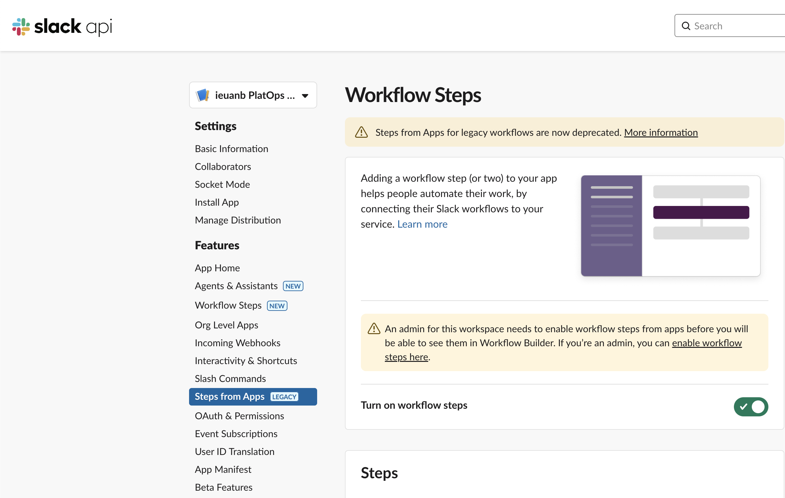
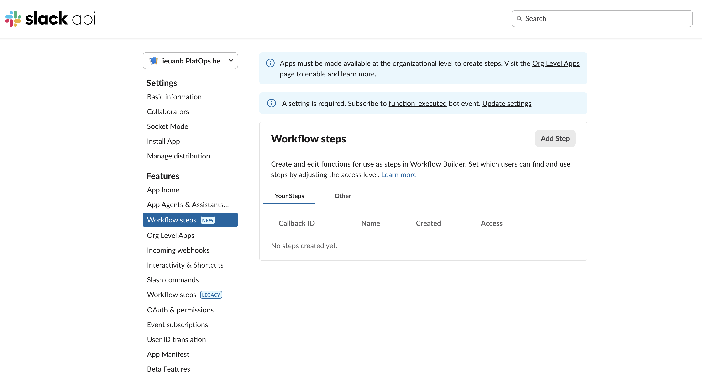
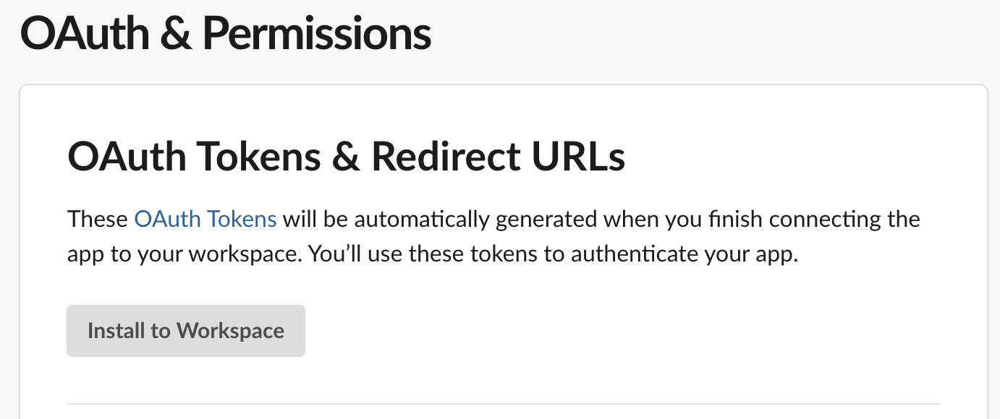

# Slack help bot

A tool to make it easier for Platform users to get help.
With a focus on sign-posting, tooling and documentation to allow users to help themselves without needing an engineers help.

## Features

- Users can request help from Platform Operations by:
  - Using the `/PlatOps help` shortcut.
  - Messaging the PlatOps help bot and saying `help`.
- While requesting help the bot will:
  - Provide initial guidance, linking to documentation, recent announcements and providing guidance on what should be raised here.
  - Link to our QnA maker bot Plato which has pre-programmed answers to some common questions.
  - Ask users to fill in some details about their request.
  - Search the `help-requests` index in `Azure AI Search` which will return the top 3 most relevant results from previous requests.
  - Search the `the-hmcts-way` index in `Azure AI Search` which will return the top 3 most relevant results from the HMCTS Way.
  - Send the data to `Azure AI Services` to determine which area, environment and team the request is likely about and will preselect these fields for the user.
  - Create a ticket in Jira with the data provided.
  - Post the request in the `#platops-help` channel.
- Help request threads support these commands by messaging `@PlatOps help <command>`:
  - `help` - list of all available commands
  - `duplicate <jira ticket id>` - mark a request as a duplicate of another ticket
  - `summarise` - an AI will summarise all replies in the Slack thread into one message
- On close of a request the bot will ask for what type of help was required and what was done to resolve the issue.
- `@PlatOps help` home page displays the following reports:
  - Open unassigned help requests
  - Assigned to me
  - Raised by me
- Auto close inactive issues
  - A cron job built into the bot will close any issues that have been not been updated for 10 days
- Analytics on usage of the bot
  - Events are recorded in Application Insights when user actions are taken, for more details see [analytics](#analytics).
  - Labels are added to Jira tickets that can be reported on in Jira to see what team / area / environment is requesting the most help

## Architecture


During help request workflow the application:

1. Asks Azure AI services for recommendation for area, environment and team.
2. Searches Azure AI search for similar requests.
3. Searches Azure AI search for anything on the hmcts way that might be relevant.
4. Creates the request in Slack and Jira.
5. Stores the request in Cosmos DB.
6. Replies on the help request Slack thread are added to Jira.
   - Replies on Jira are not added to Slack.

On close of the help request:

1. Status, resolution type and resolution comment added to cosmos DB.

Search index:

1. Search service has an indexer configured to pull new data from Cosmos DB every 5 minutes.
   - Only certain fields are configured, see the [indexer configuration](./components/infrastructure/ai-search-index.tf).
2. Knowledge store data is stored in Azure Blob Storage, which is uploaded to by a GitHub action in [hmcts/hmcts.github.io](https://github.com/hmcts/hmcts.github.io).
   - The GitHub action then triggers the indexer to update the knowledge store index.

AI summarising:

1. If a user requests a help request to be summarised, all comments are retrieved and sent to AI services for summarisation.

Azure resources:

- All azure resources are created in the [`components/infrastructure`](./components/infrastructure) folder.

## Getting Started with the Bot

### Prerequisites

Running the application requires the following tools to be installed in your environment:

- [Node.js](https://nodejs.org/) v20.0.0 or later
- [npm](https://www.npmjs.com/)
- [Docker](https://www.docker.com)
- [Azure CLI](https://docs.microsoft.com/en-gb/cli/azure/install-azure-cli) - locally only

You need to create a Slack App as detailed in the steps below.

## Creating the Slack App

For members of Platform Operations we have a test workspace that you can use `hmcts-platops-sandbox`, ask in #platform-operations for an invitation.
You'll be able to install and test changes to your app there without waiting for someone to approve the change.

1. Create a new app in your workspace. Follow the Slack documentation for [creating an app from a manifest](https://api.slack.com/reference/manifests).

Manifest, make sure you update the name:

```yaml
display_information:
  name: <your name> PlatOps help
  description: Help requests for Platform Operations
  background_color: "#262626"
features:
  app_home:
    home_tab_enabled: true
    messages_tab_enabled: false
    messages_tab_read_only_enabled: false
  bot_user:
    display_name: PlatOps help
    always_online: true
  shortcuts:
    - name: PlatOps Help Request
      type: global
      callback_id: begin_help_request_sc
      description: Request help from Platform Operations
  workflow_steps:
    - name: Begin Help Request
      callback_id: begin_help_request
oauth_config:
  scopes:
    bot:
      - app_mentions:read
      - channels:history
      - channels:read
      - chat:write
      - chat:write.customize
      - commands
      - groups:history
      - groups:read
      - groups:write
      - im:history
      - im:read
      - im:write
      - reactions:read
      - reactions:write
      - users.profile:read
      - users:read
      - users:read.email
      - workflow.steps:execute
settings:
  event_subscriptions:
    user_events:
      - app_home_opened
    bot_events:
      - app_home_opened
      - app_mention
      - message.channels
      - message.im
      - reaction_added
      - workflow_step_execute
  interactivity:
    is_enabled: true
  org_deploy_enabled: false
  socket_mode_enabled: true
  token_rotation_enabled: false
```

The manifest may not work anymore because it's using legacy the `workflow_steps` as seen in the image below:



For creating the `workflow_steps` you will need to create it within the the **Workflow Steps** feature within the Slack API:



2. Head to **OAuth & Permissions** and install the app to your workspace. Allow the app the default permissions. Copy the generated **Bot User OAuth Access Token** as this will be required for the slack-help-bot configuration.



3. Invite the app in the channel where you would like it to be used in Slack. This can be done by choosing the channel where you want the bot to be active then in the message input box of the selected channel, type the following command: `/invite @<your app's bot name>`. Make a note of the **channel ID** as this will later be required in the slack-help-bot configuration. You can get the channel ID by right-clicking, 'copy link', and then it will be the bit after archives in the url, e.g. `C01APTJAM7D`.

## Running the application

We use 'Socket mode' so no need to proxy Slack's requests.

### Running on Kubernetes

The application is deployed on Kubernetes using the [HMCTS nodejs chart](https://github.com/hmcts/chart-nodejs).
To avoid exposing sensitive data from the configuration above you can add them as secrets from an Azure Key Vault.
See the [chart-library documentation](https://github.com/hmcts/chart-library#keyvault-secret-csi-volumes) for further info.

The configuration for the deployed instance can be found in [hmcts/cnp-flux-config in the slack-help-bot kustomization](https://github.com/hmcts/cnp-flux-config/blob/master/apps/slack-help-bot/slack-help-bot/slack-help-bot.yaml).

### Running locally

All configuration requirements listed above can be found in the "env.template.txt" file.

### Initial setup

Rename "env.template.txt" to ".env" which is gitignored and safe for secrets.

Source into your shell with:

```bash
$ set -o allexport; source .env; set +o allexport
```

Install dependencies by executing the following command:

```bash
$ npm install
```

### Azure connection

The AI features of the bot are powered by a number of Azure services. To connect to these services you will need to authenticate with Azure.
If you are in the `DTS Platform Operations` Security Group you will have the permissions needed to use the services.

To authenticate with Azure, run the following command:

```bash
az login
```

[See more information on authenticating with Azure in a local development environment](https://learn.microsoft.com/en-us/javascript/api/overview/azure/identity-readme?view=azure-node-latest#authenticate-the-client-in-development-environment).

If you aren't in the `DTS Platform Operations group` you will need at least the following permissions on their respective resources:

- Cosmos DB Built-in Data Contributor - This is a cosmos specific permission and can't be assigned using the Azure Portal
- Cognitive Services OpenAI User
- Search Index Data Reader

### Starting

Run:

```bash
npm start
```

#### Running locally with Docker

There is no need to source your configuration. The ".env" file will be loaded automatically.

Create docker image:

```bash
docker compose build
```

##### Login to Azure

We are using the [azure-cli-credentials-proxy](https://github.com/gsoft-inc/azure-cli-credentials-proxy) to re-use
your local access token without having to pass credentials to the container.

Follow the same instructions as in [Azure connection](#azure-connection) to authenticate with Azure.

##### Start the application

Run the application by executing the following command:

```bash
docker compose up
```

This will start the frontend container exposing the application's port
(set to `3000` in this template app).

In order to test if the application is up, you can visit https://localhost:3000/health in your browser.
You should get a very basic health page.

## Analytics

The bot uses Application Insights to record events when users interact with the bot.
The resource is called `slack-help-bot-ptl`.

Here are a couple of useful queries:

[Pie chart query in Log Analytics](https://portal.azure.com#@531ff96d-0ae9-462a-8d2d-bec7c0b42082/blade/Microsoft_OperationsManagementSuite_Workspace/Logs.ReactView/resourceId/%2Fsubscriptions%2F1baf5470-1c3e-40d3-a6f7-74bfbce4b348%2FresourceGroups%2Fslack-help-bot-cftptl-intsvc-rg%2Fproviders%2FMicrosoft.Insights%2Fcomponents%2Fslack-help-bot-ptl/source/LogsBlade.AnalyticsShareLinkToQuery/q/H4sIAAAAAAAAA0suLS7Jz3UtS80rKeaqUSguzc1NLMqsSlVIBQnFJ%252BeX5pUo2CqAaQ1NhaRKhbzE3FSgyqLUvJTUIoWCzNTkjMSiEgA13VyNSAAAAA%253D%253D/timespan/P7D/limit/1000)

```kql
customEvents
| summarize event_count = count() by name
| render piechart
```

[Column chart query in Log Analytics](https://portal.azure.com#@531ff96d-0ae9-462a-8d2d-bec7c0b42082/blade/Microsoft_OperationsManagementSuite_Workspace/Logs.ReactView/resourceId/%2Fsubscriptions%2F1baf5470-1c3e-40d3-a6f7-74bfbce4b348%2FresourceGroups%2Fslack-help-bot-cftptl-intsvc-rg%2Fproviders%2FMicrosoft.Insights%2Fcomponents%2Fslack-help-bot-ptl/source/LogsBlade.AnalyticsShareLinkToQuery/q/H4sIAAAAAAAAAx2LSQqAMAwA774ixxZ68QEefYekbcCCSSVNBcXHu5wGhpnUm1WeDxJrww2tM6OWi4A%252BtaTaxWCCn85DPCEWcVaYmiHvAcbsAwgyvbeSZNI33jpLWlHtAQAQGCVfAAAA/timespan/P7D/limit/1000)

```kql
customEvents
| summarize event_count = count() by bin(timestamp, 1d), name
| render columnchart
```

## Deploying

This application is deployed with continuous delivery, every merge to the main branch will be automatically deployed.
The [GitHub action](./.github/workflows/main.yml) will build the docker image and push it to the Azure Container Registry.

The deployment configuration can be found in the [hmcts/cnp-flux-config repository](https://github.com/hmcts/cnp-flux-config/blob/master/apps/slack-help-bot/slack-help-bot/slack-help-bot.yaml).

The infrastructure from the [architecture diagram](#architecture) is created using Terraform in the [components/infrastructure](./components/infrastructure) folder.
The [terraform pipeline](pipeline/azure-pipelines.yml) is run from Azure DevOps, a plan is run on a pull request and it will automatically apply on merge to main.

## Adding new fields to dropdowns

If you want to add new fields to dropdowns like the area or resolution type the easiest way is to search for the text of another option in the codebase and then add your new option there.
They are normally sorted in alphabetical order although environments are generally in increasing order of importance and Other is normally last.

For most dropdowns you will also need to update the [LLM prompt](./src/ai/prompts.js) to allow it to suggest the new option, resolution type doesn't need to be added there.

Dropdowns use the `optionBlock` function, it can take either one or two arguments, the first argument is the display name and the second is the label that will be used in Jira.
Certain characters can't be used in Jira labels so if you have a complex display name then supply a simpler label or if a team is commonly known by a short name it is common to use the short name in the label as well.

e.g.

```javascript
optionBlock("GitHub");
```

or

```javascript
optionBlock("Security Operations / Secure Design", "security");
```
