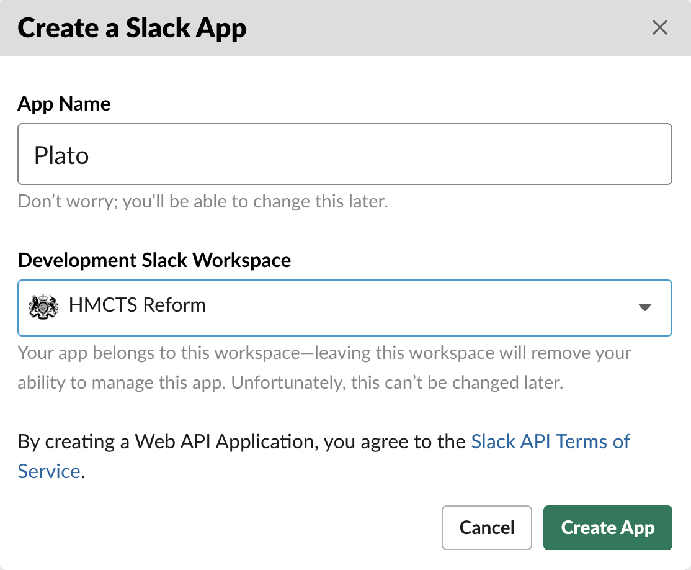
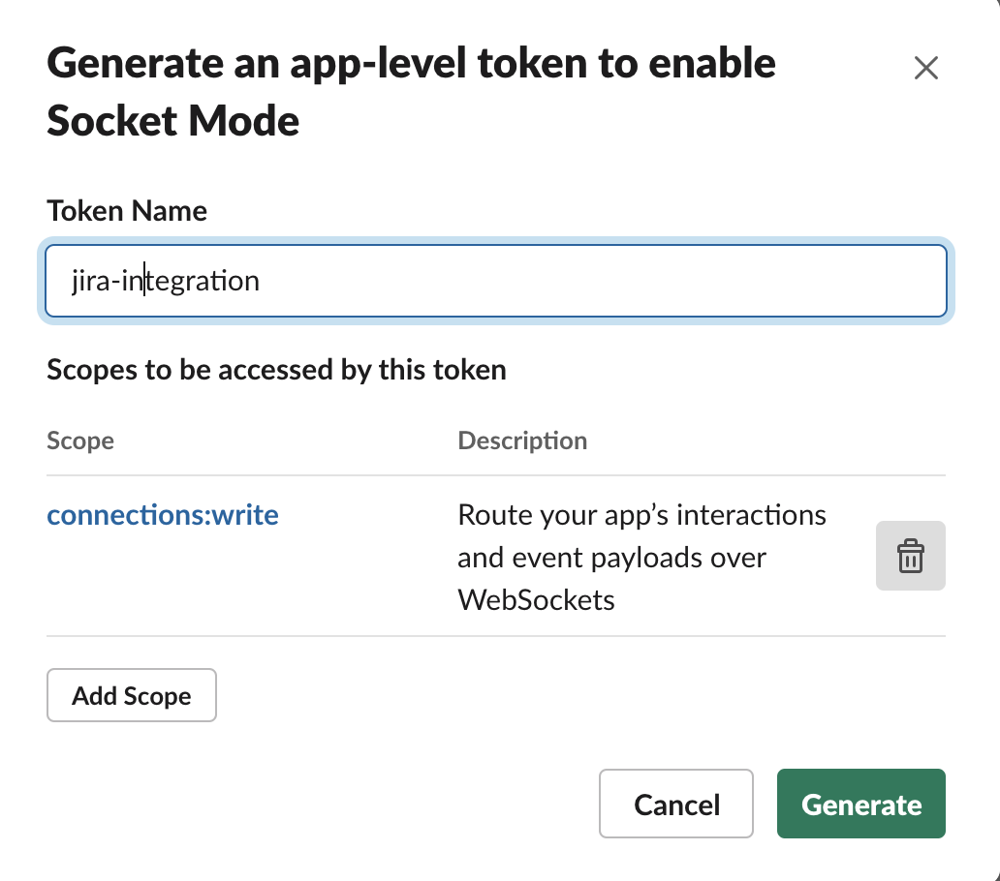
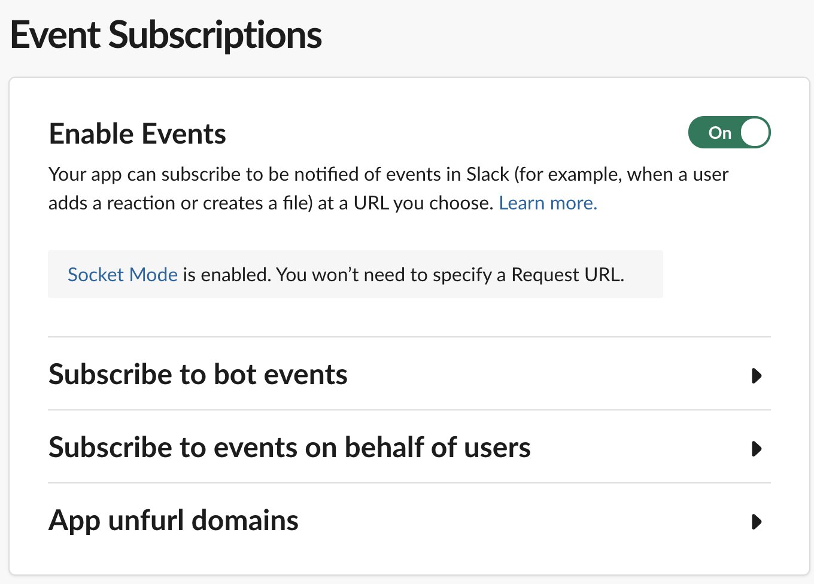
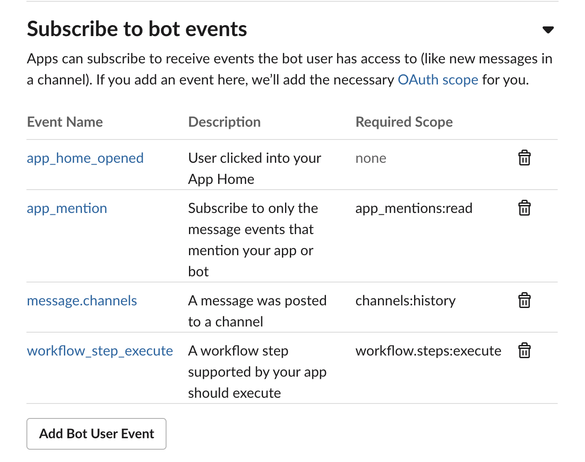
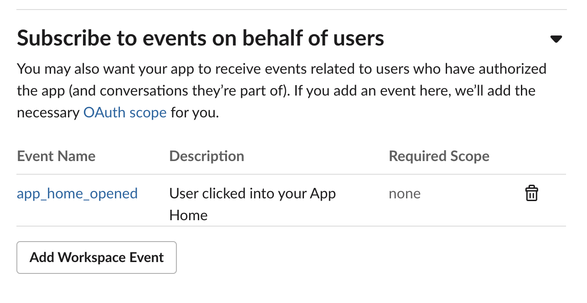
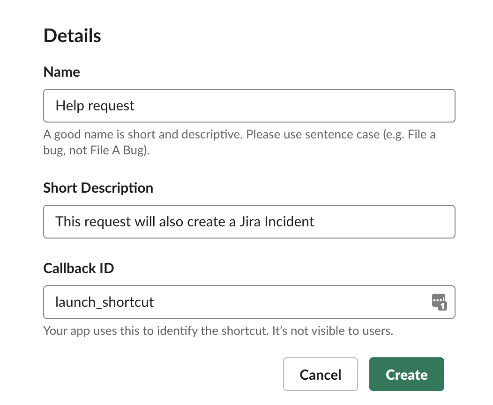

# Slack help bot

Listens for new posts in a designated Slack channel and raises a coresponding request in Jira.

## Creating the Slack App

<details>
  <summary>Steps</summary>

1. Create a new app in your workspace.



2. Head to socket mode and enable it. You will then be asked to create a new token (call it **jira-integration**) This will only have **connections:write** in the scope. Select **Generate**. Copy the generated token as this will be required for the slack-help-bot configuration.



3. Head to **Event subscriptions** and enable it.



4. Expand the **Subscribe to bot events** tab, add the following settings and save changes.



5. Expand the **Subscribe to events on behalf of users** tab, add the following settings and save changes.



6. Head to **Interactivity and shortcuts** and create a **Global** shortcut with the following settings and save changes.



7. Head to **Oauth and Permissions** and install the app to your workspace. Allow the app the default permissions. Copy the generated **Bot User OAuth Access Token** as this will be required for the slack-help-bot configuration.


8. Invite the app in the channel where you would like it to be used in Slack. Make a note of the **channel ID** as this will later be required in the slack-help-bot configuration. You can get the channel ID by right clicking, 'copy link', and then it will be the bit after archives in the url, e.g. `C01APTJAM7D`.

</details>

## Getting Started with the Bot

### Prerequisites

Running the application requires the following tools to be installed in your environment:

- [Node.js](https://nodejs.org/) v14.0.0 or later
- [npm](https://www.npmjs.com/)
- [Docker](https://www.docker.com)

You need to create a Slack App as detailed in the steps above. For development purposes, this will have to be created in a new Slack workspace.
You will also need the JIRA details. For development purposes, these values can be found in the "env.template.txt" file for the HMCTS Jira SBOX Project.

Set the relevant environment variables defined in [env.template.txt](env.template.txt) based on above steps.

## Running the application

We use 'Socket mode' so no need to proxy Slack's requests.

### Running on Kubernetes

The application can be deployed on Kubernetes using the [HMCTS nodejs chart](https://github.com/hmcts/chart-nodejs). To avoid exposing sensitive data from the configuration above you can add them as secrets from an Azure Key Vault. See the chart documentation for further info.

### Running locally

All configuration requirements listed above can be found in the "env.template.txt" file.

Rename "env.template.txt" to ".env" which is gitignored and safe for secrets.

Source into your shell with:

```bash
$ set -o allexport; source .env; set +o allexport
```

Install dependencies by executing the following command:

```bash
$ npm install
```

Run:

```bash
$ node app.js
```

#### Running locally with Docker

There is no need to source your configuration. The ".env" file will be mounted as a volume.

Create docker image:

```bash
  docker-compose build
```

Run the application by executing the following command:

```bash
  docker-compose up
```

This will start the frontend container exposing the application's port
(set to `3000` in this template app).

In order to test if the application is up, you can visit https://localhost:3000/health in your browser.
You should get a very basic health page (no styles, etc.).
